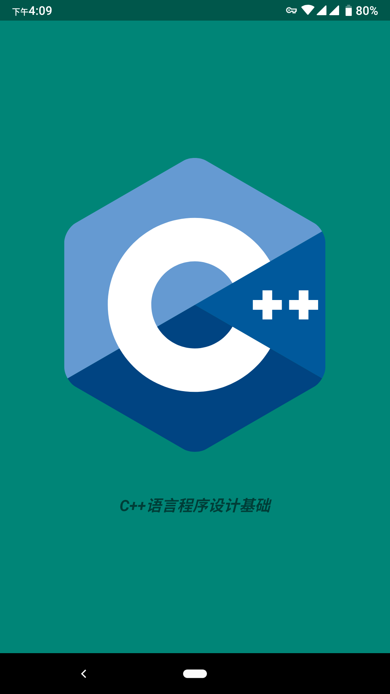
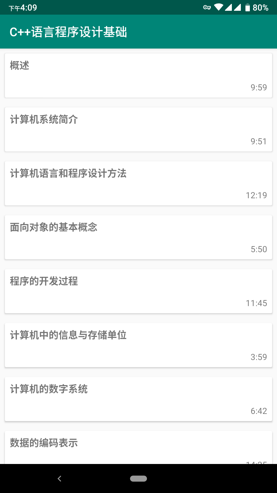
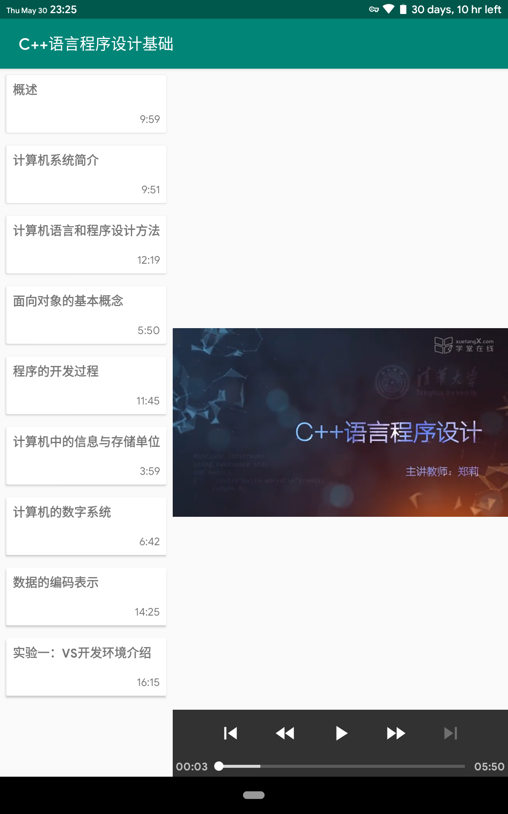
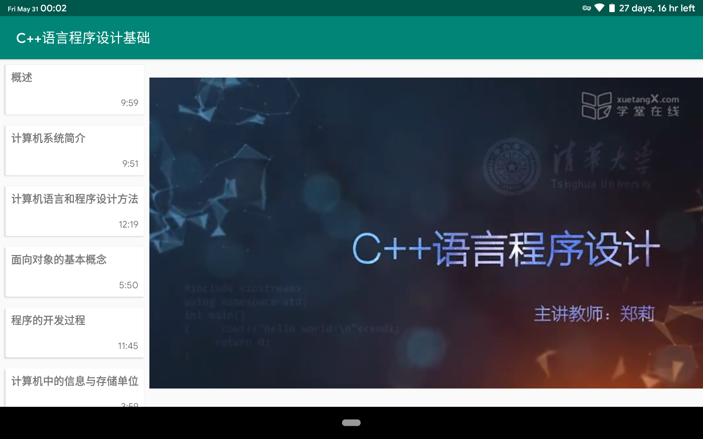
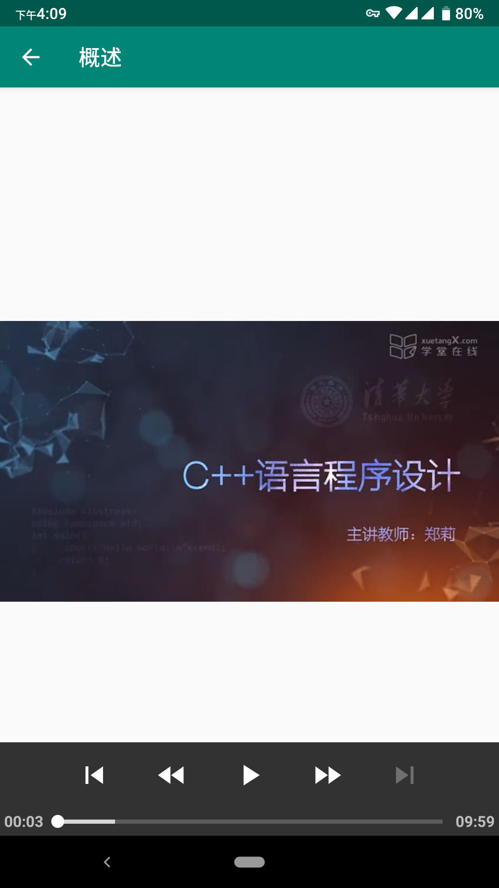

# 安卓应用 - 视频播放器简单示例

## 首屏 | Splash Activity

展示 C++ Logo 及应用名称，延时两秒自动淡出至主页面。



### 核心代码

```kotlin
Handler().postDelayed({
    startActivity(Intent(this, MainActivity::class.java))
    finish(); overridePendingTransition(anim.fade_in, anim.fade_out)  // use fade animation
}, DELAY_MILLIS)  // jump to MainActivity after delay
```

> 完整代码详见 [SplashActivity.kt](app/src/main/java/io/github/liolok/exoplayer_sample/SplashActivity.kt)

## 主页面 | Main Activity

适配两种布局，单窗格（默认）和双窗格（Dual Pane），使用布局文件的限定符 `sw600dp`（最小宽度为 600dp 的屏幕）及 `Fragment` 实现。

### 单窗格



### 双窗格



### 双窗格横屏



### 核心代码

判断当前布局类型：

```kotlin
// Determine current layout: https://developer.android.com/training/multiscreen/adaptui#TaskDetermineCurLayout
val fragmentContainer: View? = findViewById(R.id.fragmentContainer)
isDualPane = fragmentContainer?.visibility == View.VISIBLE
```

双窗格布局下，使用列表首个条目添加默认 Fragment：

```kotlin
if (isDualPane) {
    // However, if we're being restored from a previous state,
    // then we don't need to do anything and should return or else
    // we could end up with overlapping fragments.
    if (savedInstanceState != null) return

    val defaultFragment = PlayerFragment()  // create a new Fragment to be placed in the activity layout
    val bundle = Bundle(); bundle.putParcelable(Item.EXTRA_KEY, items[0])  // pack first item up with a bundle
    defaultFragment.arguments = bundle  // pass first item to default fragment

    // Add the fragment to the 'fragmentContainer' FrameLayout
    supportFragmentManager.beginTransaction().add(R.id.fragmentContainer, defaultFragment).commit()
}
```

针对两种不同布局，对列表条目的点击进行不同的操作。双窗格布局下替换 `Fragment`，单窗格布局下启动 `DetailActivity`（详情页面）：

```kotlin
override fun onItemClick(item: Item) {
    if (isDualPane) {
        val newFragment = PlayerFragment()
        val bundle = Bundle(); bundle.putParcelable(Item.EXTRA_KEY, item)  // pack the item up with a bundle
        newFragment.arguments = bundle  // pass first item to first fragment
        supportFragmentManager.beginTransaction().replace(R.id.fragmentContainer, newFragment).commit()
    }  // layout is at sw600dp variation, replace fragment on list item clicked.
    else {
        startActivity(Intent(this, DetailActivity::class.java).putExtra(Item.EXTRA_KEY, item))
    }  // layout is at normal variation, start detail activity on list item clicked.
}  // implement RecyclerAdapter.OnItemClickListener
```

> 以上片段完整代码详见 [MainActivity.kt](app/src/main/java/io/github/liolok/exoplayer_sample/MainActivity.kt)

两种布局公共部分为视频列表，列表使用 `RecyclerView` 实现，条目使用 `CardView` 实现，两者的绑定代码如下：

```kotlin
// Provide a reference to the views for each item
class ItemViewHolder(itemView: View) : RecyclerView.ViewHolder(itemView) {
    fun bind(item: Item, listener: OnItemClickListener) = with(itemView) {
        title.text = item.title
        duration.text = item.duration
        setOnClickListener { listener.onItemClick(item) }
    }  // bind an item object to its view
}
```

> 完整代码详见 [RecyclerAdapter.kt](app/src/main/java/io/github/liolok/exoplayer_sample/RecyclerAdapter.kt)

## 详情 | Detail Activity



视频播放核心代码移至 `PlayerFragment` 以在不同布局下复用，在 `DetailActivity` 中仅需将 `MainActivity` 的传入数据再次传递给 `PlayerFragment` 并添加即可：

### 核心代码

```kotlin
val playerFragment = PlayerFragment()  // create a player fragment

val item = intent.getParcelableExtra<Item>(Item.EXTRA_KEY)  // get item object from MainActivity
supportActionBar?.title = item.title  // set actionbar title with item's
val bundle = Bundle(); bundle.putParcelable(Item.EXTRA_KEY, item)  // pack item object up with a bundle
playerFragment.arguments = bundle  // pass item object to player fragment through bundle

supportFragmentManager.beginTransaction().add(R.id.detailContainer, playerFragment).commit()  // show fragment
```

> 完整代码详见 [DetailActivity.kt](app/src/main/java/io/github/liolok/exoplayer_sample/DetailActivity.kt)

## 视频播放

使用 ExoPlayer 库简单实现，支持缓冲就绪自动播放：

### 核心代码

```kotlin
class PlayerFragment : Fragment() {
    private lateinit var player: SimpleExoPlayer

    override fun onCreateView(inflater: LayoutInflater, container: ViewGroup?, savedInstanceState: Bundle?): View? {
        if (container == null) return null  // create and return view only in dual pane mode

        val playerView = PlayerView(activity)

        // https://exoplayer.dev/hello-world.html
        player = ExoPlayerFactory.newSimpleInstance(activity)  // initialize player instance
        playerView.player = player  // bind the player to the view
        val item = arguments?.getParcelable<Item>(Item.EXTRA_KEY)  // get item object from list activity
        player.apply {
            playWhenReady = true  // whether auto-play video when ready
            prepare(
                ProgressiveMediaSource.Factory(DefaultHttpDataSourceFactory(getString(R.string.app_name)))
                    .createMediaSource(Uri.parse(item?.url))
            )  // prepare the player with `ProgressiveMediaSource`, which is for regular media files like "*.mp4".
        }

        return playerView
    }

    override fun onDestroy() {
        super.onDestroy()
        player.release()  // release the player when fragment is destroyed, or it will still play in background.
    }
}
```

> 完整代码详见 [PlayerFragment.kt](app/src/main/java/io/github/liolok/exoplayer_sample/PlayerFragment.kt)

## 数据字典

```kotlin
@Parcelize  // for intent extra, see more in RecyclerAdapter.ItemViewHolder.onClick() and DetailActivity.onCreate()
@Serializable  // for reading list from json resource file, see more in MainActivity.onCreate()
data class Item(val title: String, val duration: String, val url: String) : Parcelable {
    companion object {
        const val EXTRA_KEY = "${BuildConfig.APPLICATION_ID}.Item"
    }  // intent extra key, use app's package name as prefix to be unique
}
```

初始数据存储在 [`res/raw/items.json`](app/src/main/res/raw/items.json)，在 `MainActivity` 中使用 `Kotlinx Serialization` 解析并传递给 `RecyclerAdapter`。

## 心得体会

- 视频播放：ExoPlayer 作为一个半官方库，可以轻松胜任简单的播放需求，同时扩展性也很强，可实现更多功能，如记住播放位置等；
- 适应性布局：Android 官方提供了一个较为人性化的 UI 设计方式，实现一个简单的适应性布局并不算太难。

## 参考资料

- ExoPlayer
  - [ExoPlayer | Android Developers](https://developer.android.com/guide/topics/media/exoplayer "ExoPlayer | Android Developers")
  - [Hello world! - ExoPlayer](https://exoplayer.dev/hello-world.html "Hello world! - ExoPlayer")
- 适应性布局
  - 使用最小宽度限定符：[支持不同屏幕尺寸  |  Android Developers](https://developer.android.com/training/multiscreen/screensizes?hl=zh-cn#TaskUseSWQuali "支持不同屏幕尺寸  |  Android Developers")
  - [构建灵活的界面 | Android Developers](https://developer.android.com/training/basics/fragments/fragment-ui?hl=zh-CN "构建灵活的界面 | Android Developers")
