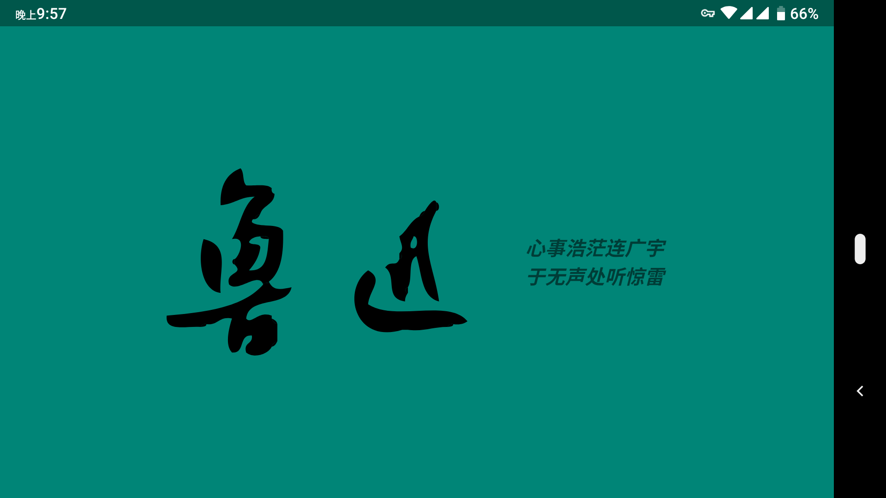

# 安卓应用 - 鲁迅经典语录鉴赏

## 整体预览

> 待添加动图

## 首屏 | Splash Activity

延时 `2s` 自动跳转至 `List Activity` 列表页

横屏布局（[`res/layout-land/activity_splash.xml`](app/src/main/res/layout-land/activity_splash.xml)）预览图：

## 列表 | List Activity

使用 RecyclerView 实现

## 详情 | Detail Activity

- 标题工具栏内显示书籍封面图：使用 `CollapsingToolbarLayout` 实现；
- 评分条分值保存：使用 `SharedPreference` 实现；
- 与 List Activity 间的过渡动画：使用 `Shared Element Transition` 实现。

## 已知问题

从列表页进入详情页的过渡动画会覆盖虚拟导航栏
